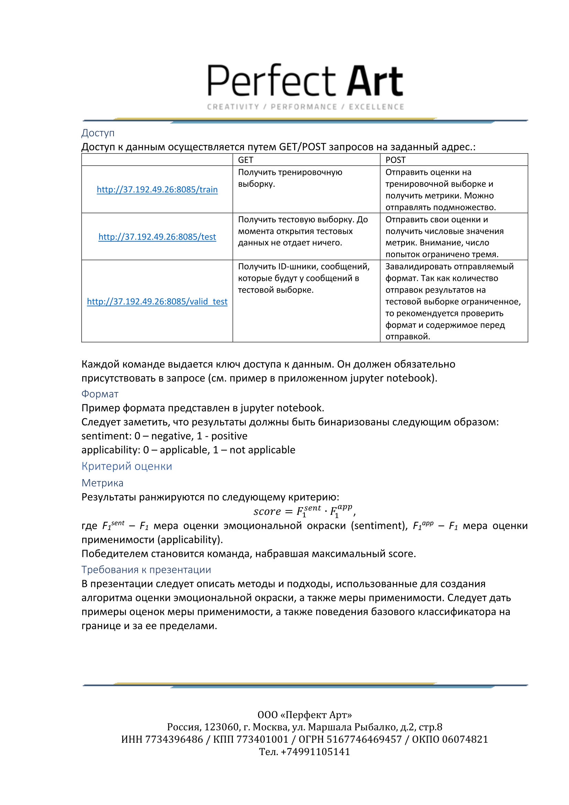

# LinguaHack 2019
Кейсы и датасеты для LinguaHack Tomsk 2019

## О чем ты, текст?

### Автор
Информационное агенство ТАСС

### Проблема 
Одной из составных задач информационного поиска является отнесение документа к одной из нескольких категорий на основании содержания документа. Самым сложным в этом процессе считается предтекстовая обработка и выявление информативных признаков. Они являются исходными данными для алгоритмов машинного обучения. Однако многие результаты работы классификаторов «привязаны» к обучающей выборке и показывают нестабильные результаты на неизвестных текстах. 

### Задача 
Дан набор новостных текстов разной тематики, размеченных по категориям (политика, экономика и спорт). Требуется построить классификатор, оценивающий вероятность принадлежности текста к той или иной теме. 

### Данные 
Исходный корпус содержит набор кортежей `[id текста, текст, класс новости (политика, экономика и спорт)]`. Для представления результатов обучения выборку нужно разбить на обучающую и тестовую (70:30).

### Формальный критерий оценки
Результаты классификации текстов будут оцениваться по [F-мере](http://bazhenov.me/blog/2012/07/21/classification-performance-evaluation.html), представляющей собой гармоническое среднее между точностью и полнотой. 

### Требования к презентации 
В презентации следует описать методы и подходы, использованные для создания алгоритма классификации текстов, а также полученные результаты и их интерпретацию.

---

## Грань вселенной

---

## Распознавание речи

### Автор
Лаборатория лингвистической антропологии

### Проблема 
Современные технологии позволяют преобразовывать устную речь в текст. Существует немало инструментов, позволяющих осуществить подобную задачу на разных языках, однако сегодня в Российской Федерации существуют языки, которые не являются популярными….

### Задача 
Дан размеченный набор звуковых файлов языков народов (тут нужен определенный один язык). Требуется разработать алгоритм, распознающий речь... 

### Данные 
Исходные данные представлены в виде набора звуковых файлов и соответствующей разметки в программе …..

### Формальный критерий оценки 
Результаты распознания речи будут оцениваться по метрике WCR (Word Correctly Recognized). W = (H/D)*100, где Н – количество правильно распознанных слов, D – общее количество слов. Метрику требуется максимизировать.

### Требования к презентации 
В презентации следует описать методы и подходы, использованные для создания алгоритма распознавания речи, а также полученные результаты и их интерпретацию.

---

## Извлечение именованных сущностей

### Автор
Лаборатория когнитивных исследований языка

### Проблема 
Сегодня в большом объеме потока информации необходимо оперативно отслеживать изменения в обществе за счет структуризации материала и автоматизации извлечения информации из текста. 

### Задача 
Дан набор новостных текстов разной тематики. Требуется разработать алгоритмы, извлекающие следующие факты: 
- Имена стран и населённых пунктов Российской Федерации.
- Имена президентов и администрации федеральных округов. 

### Данные 
Массив текстов, содержащий набор новостей в формате .txt (кодировка - UTF-8).

### Формальный критерий оценки
Результаты будут оцениваться лингвистическим анализом написанных формальных грамматик и качества извлеченных фактов.

### Требования к презентации 
В презентации следует описать методы и подходы, использованные для извлечения фактов и текстов, а также полученные результаты и их интерпретацию.

---

## Побочные реакции

### Автор

МТС

### Цель 

Использовать методы NLP для извлечения информации о негативных реакциях на употребление медицинских препаратов.

### Данные
Предлагается датасет из описаний более тысячи препаратов на английском языке в формате XML. Из них для 101 препарата есть соответствующая разметка содержащихся в описании сущностей.

### Сущности
Описание препарата может содержать следующие сущности
1. Негативные реакции (AdverseReaction) – описание негативных реакций связанных с данным препаратом, либо его компонентами. Могут включать симптомы, медицинские показания и т.д.
2. Показатель воздействия (Severity) – мера воздействия негативной реакции может быть как качественной ("major", "critical", "serious", "life-threatening") так и количественной ("grade 1", "Grade 3-4", "3 times upper limit of normal (ULN)", "240 mg/dL")
3. Класс препарата (DrugClass) – Препараты могут принадлежать к одному или нескольким классам например бета блокаторы.
4. Животные (Animals) – виды животных у которых наблюдались негативные реакции.
5. Отрицание (Negation) – слово благодаря которому негативная реакция отрицается (что-то что предотвращает негативную реакцию).
6. Фактор (Factor) – Дополнительные параметры негативных реакций которые не покрыты предыдущими пунктами.

### Отношения 
Негативные реакции могут вступать в следующие типы отношений
1. Отрицается (Negated) – Negation или Factor который нейтрализует AdverseReaction.
2. Гипотетически (Hypothetical) – Animal, DrugClass или Factor который гипотетически вызывает AdverseReaction.
3. Эффект (Effect) – Severity AdverseReaction для данного препарата. Описывает силу реакции негативного эффекта.

### Задачи
1. Named Entity Recognition: Из текстовых описаний препарата извлечь негативные реакции (AdverseReactions) и связанные с ними сущности (Severity, DrugClass, Animals, Negation, Factor)
2. Relation identification evaluations: Идентифицировать отношения между негативными реакциями (AdverseReactions) и связанными сущностями (Severity, DrugClass, Animals, Negation, Factor). Отношения описываются как (Negated, Hypothetical, Effect)

### Формат данных
Датасет содержит xml файлы по одному для каждого препарата. Тэг label  в атрибуте drug содержит название препарата. В тэге Text находится текстовое описание, тэг Text содержит один или несколько тэгов Section, каждый из которых содержит текст по одной из 3-х тем “Adverse Reactions”, “Warnings and Precautions”, “Boxed Warnings”.
В тэге  Mentions содержатся размеченные именованные сущности, а в тэге Relations отношения между ними.
